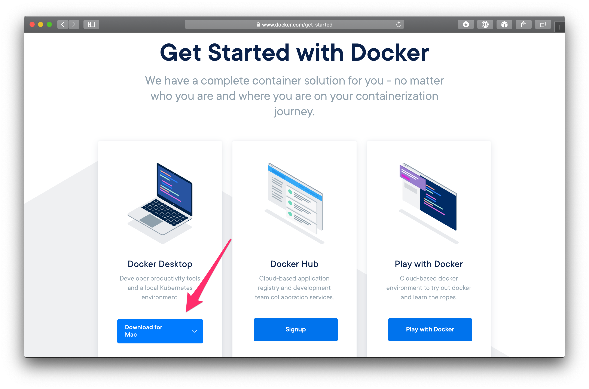
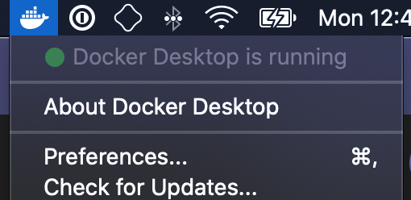
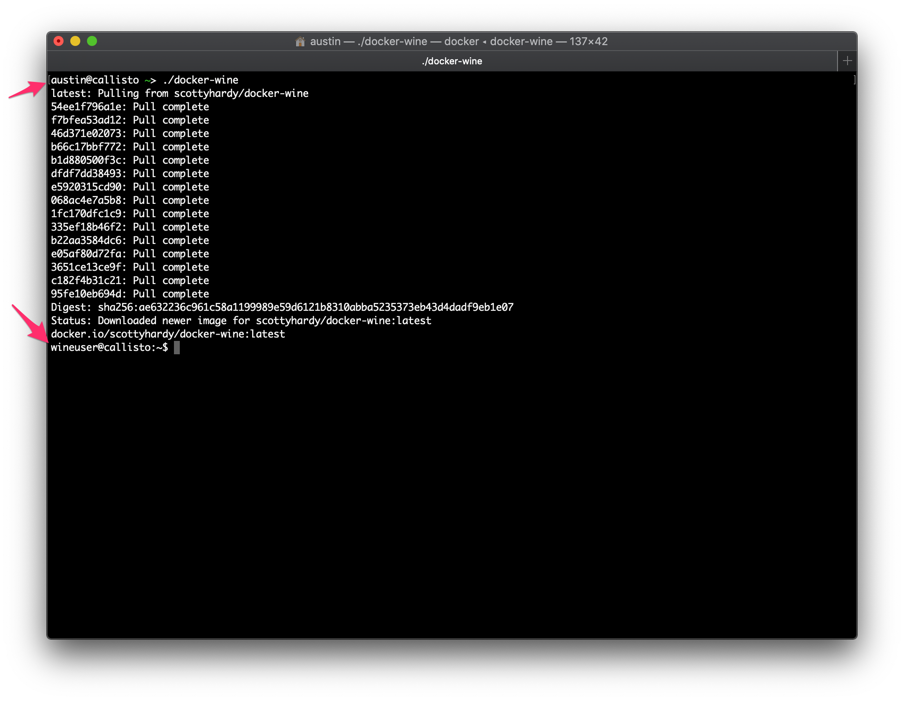
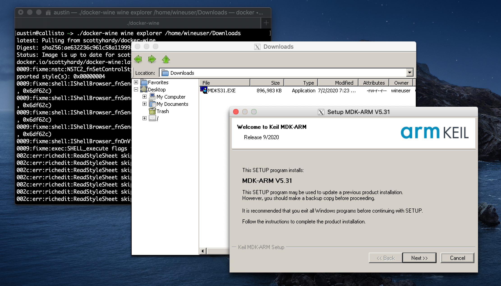

# Keil for Docker

A guide for installing the Keil ARM MDK on macOS and Linux

## Introduction

This guide will help you setup an environment that will allow you to use the complete ARM Keil MDK on a macOS or Linux desktop computer. 

This will create an isolated environment that is completely separate from your "host" operating system. This does NOT require installing or activating Windows and is much faster than VirtualBox and doesn't require rebooting like BootCamp.

**⚠️ This guide and screenshots follow the procedure for usage on a macOS computer. If you are running a Linux Desktop, the procedures are basically the same. If you have Linux Desktop installed, you probably know what you're doing anyway. ⚠️**

This works be utilizing 2 different tools called [Docker](https://en.wikipedia.org/wiki/Docker_(software)) and [Wine](https://en.wikipedia.org/wiki/Wine_(software)).

#### Docker is...

> Docker is a set of platform as a service (PaaS) products that use OS-level virtualization to deliver software in packages called containers.

#### Wine is...

> Wine (recursive backronym for _Wine Is Not an Emulator_) is a free and open-source compatibility layer that aims to allow application software and computer games developed for Microsoft Windows to run on Unix-like operating systems.

## Prerequisites
- macOS or Linux deskop
- [XQuartz](https://www.xquartz.org) (macOS only)
- [Xcode](https://apps.apple.com/us/app/xcode/id497799835?mt=12) (macOS only, 8.1GB download)
- Root and/or local administrator privileges 
- Up to 3GB of free disk space
- Basic familiarity with the command-line, bash, and navigating directories

## Installation Procedure

0. Install all prerequisites (literally, read the paragraph immediately before this one).

1. Install [Docker Desktop](https://www.docker.com/get-started). It doesn't matter if you use Docker CE (Community Edition) or another alternative, we just need Docker installed.

    

    

2. Launch Docker Desktop and confirm that it is running and ready.

    

3. Open Terminal and execute the following to download the driver script from [scottyhardy/docker-wine](https://github.com/scottyhardy/docker-wine) on Github. This will put a script file named `docker-wine` into your home directory.

    **Run the following commands:**
    ```
    curl https://raw.githubusercontent.com/scottyhardy/docker-wine/master/docker-wine -o ~/docker-wine
    chmod +x ~/docker-wine
    ```

4. Do a test run of the driver script. Using `./` in front of the name of a file denotes that you wish to execute the file as a program.

    **Run the following command:**
    ```
    ./docker-wine
    ```

    Below is a screenshot of what output you should expect if the driver script is working as intended.

    

    You'll notice that the `UserName@ComputerName` message has changed in your Terminal. This is because you now have an active terminal session inside the virtual machine right now! To exit, type the word `exit` and press Enter, or use the shortcut `CTRL+D`.

    **This will print out any warnings or errors if there is a problem setting up your environment. Read them and follow the instructions.**

    A common issue is getting a message such as:
    
    > INFO: XQuartz configuration updated.  Please reboot to enable X11 forwarding to operate.

    If you get this message, reboot and then try again.

5. Once you've confirmed that your driver script is **operational**, you're ready to install the Keil ARM MDK inside your virtual environment.

    **Run the following command:**
    ```
    ./docker-wine wget https://armkeil.blob.core.windows.net/eval/MDK531.EXE -P /home/wineuser/Downloads
    ```

    The above command will start the download of the Keil ARM MDK installer to the "Downloads" folder inside your virtual environment.

    

    **Run the following command:**
    ```
    ./docker-wine wine explorer /home/wineuser/Downloads
    ```

    The above command will open a minimal clone of _Windows Explorer_ at the virtual "Downloads" folder. With the window open, double-click on the `MDK**.exe` installer.

    

    At the end of the the Keil ARM MDK installation, there will be an error that resembles the error below. It will happen during the _"Create Program Symbols ..."_ step of the installation process. **This is expected and safe to ignore.**

    

